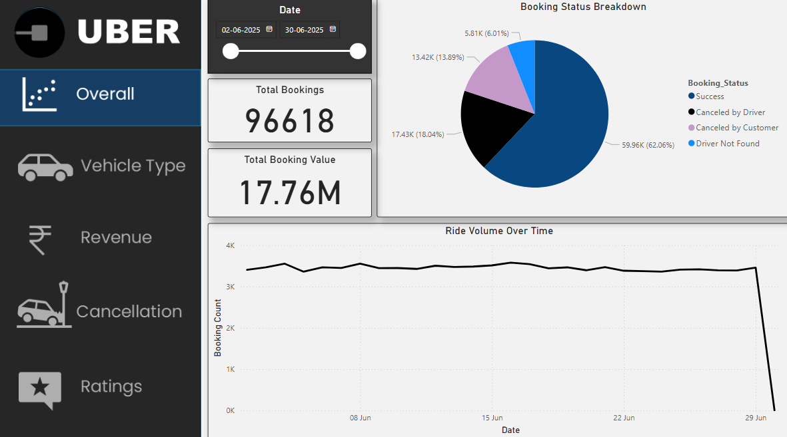
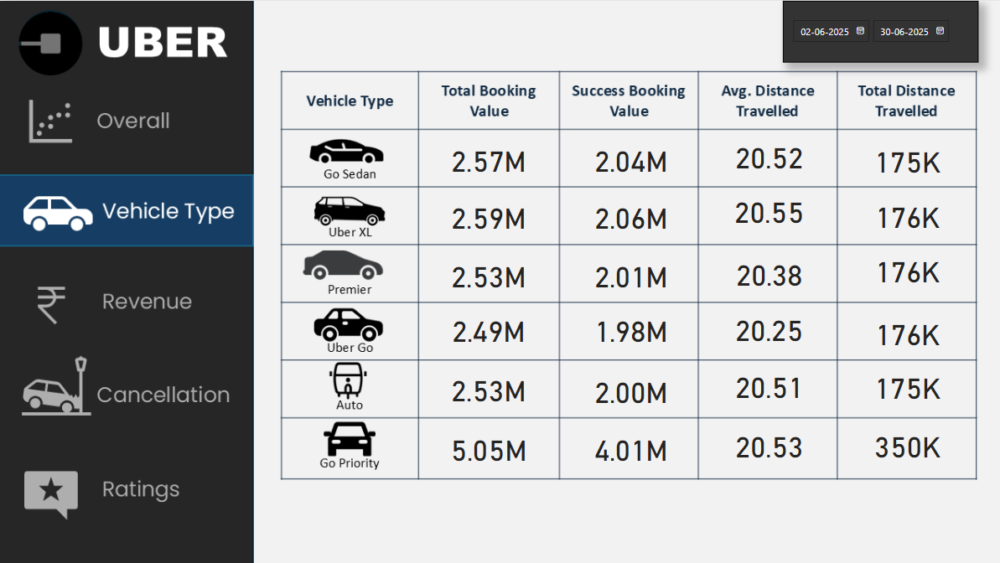
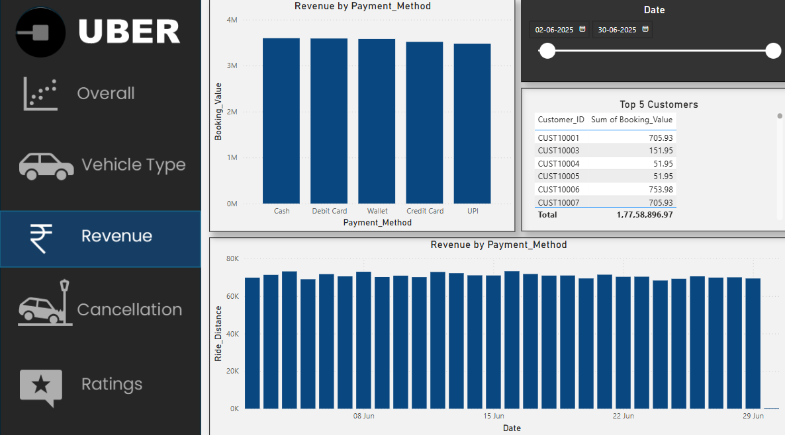
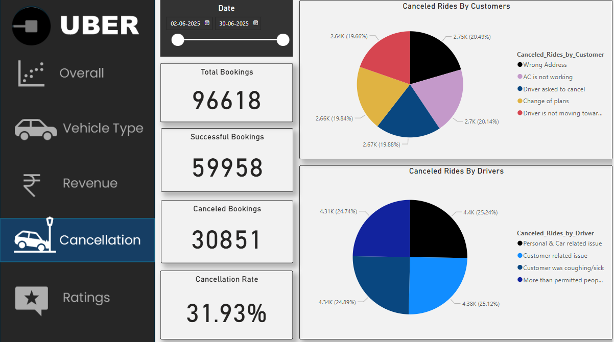
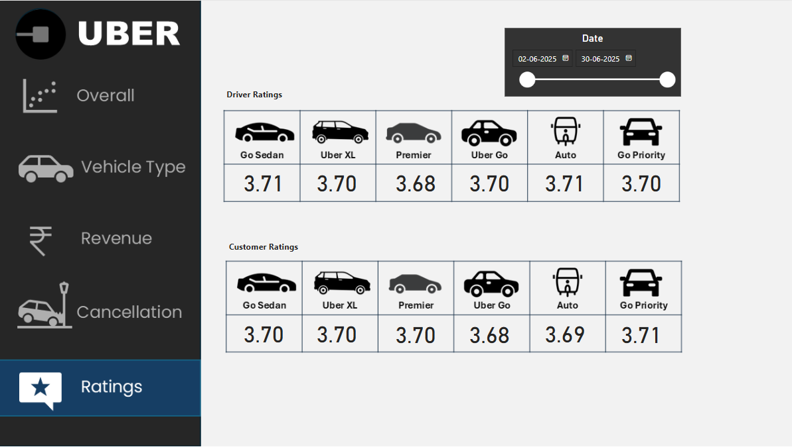

# 🚕 Uber Data Analysis Dashboard  

An end-to-end data analytics project to uncover insights from Uber’s booking data. The project uses Excel for data cleaning, Power BI for dashboard creation, and SQL for solving specific business questions.  

This repository showcases how raw data can be transformed into a **dynamic dashboard** to help stakeholders understand booking trends, customer behavior, operational bottlenecks, and revenue drivers.  

---

## 🛠 Tech Stack
- **Power BI Desktop**: For creating interactive dashboards  
- **Power Query**: Data cleaning & transformation  
- **DAX (Data Analysis Expressions)**: For calculated columns and measures  
- **PostgreSQL**: Solved analytical queries for business questions  
- **Excel**: Data preprocessing  

---

## 📂 Data Source
A **synthetic dataset** was created to simulate Uber’s bookings, cancellations, customer details, and payment methods for the month of June.  

---

## ✨ Features & Highlights

### 🏢 **Business Problem**  
Uber wants to understand user trends, booking performance, and reasons behind cancellations to improve service quality and revenue.  

### 🎯 **Goal of the Dashboard**
To provide stakeholders with:  
- Clear **KPIs and trends** for monitoring operations  
- Insights into **customer behavior & satisfaction**  
- Areas of improvement for **reducing cancellations**  

## 🔑 **Key Visuals (Brief Walkthrough)**  

### 📈 Ride Volume Over Time  
Identifies booking trends and peak hours.  

---

### 📊 Booking Status Breakdown  
Highlights success rates and cancellations.  

---

### 🚗 Top Vehicle Types by Ride Distance  
Reveals the most-used services based on ride distance.  

---

### ⭐ Average Customer Ratings by Vehicle Type  
Measures service quality across vehicle types.  

---

### ❌ Canceled Rides Reasons  
Shows why customers and drivers cancel rides.  

---

## 📊 **Business Impact & Insights**
- Cancellation rate (~32%) indicates operational gaps.  
- *Go Priority* leads in distance covered and ratings.  
- Cash & Debit Cards dominate payment methods; UPI is underutilized.  
- Balanced ratings between customers and drivers reflect mutual satisfaction.  

---

## 👩‍💻 Author
**Ajmeri Khatun**  

📅 July 2025  

---
