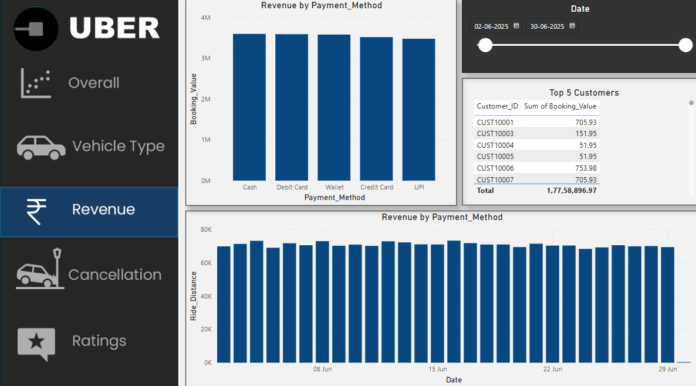

# 🚕 Uber Data Analysis - Power BI Questions

This document showcases answers to 10 business questions using interactive dashboards built in Power BI. The analysis highlights key trends in Uber’s bookings, cancellations, customer behavior, and revenue drivers.

The data was cleaned and prepared using **Excel**, and Power BI was used to create visualizations. SQL was used separately to solve some analytical queries during exploration.

---

## 📊 1. Ride Volume Over Time
✅ **Insight:** Ride volume remained steady throughout June, with minor peaks. A sharp drop was observed at the month’s end, possibly due to data cut-off.

---

## 📊 2. Booking Status Breakdown
✅ **Insight:**  
- ✅ **Successful Bookings:** 62.06%  
- ❌ **Canceled by Customer:** 18.04%  
- ❌ **Canceled by Driver:** 13.89%  
- ⚠ **Driver Not Found:** 6.01%  

The overall cancellation rate (~32%) highlights operational inefficiencies.

---

## 📊 3. Top 5 Vehicle Types by Ride Distance
✅ **Insight:** *Go Priority* recorded the highest total ride distance (350K km), while other vehicle types were in the range of ~175K km.

---

## 📊 4. Average Customer Ratings by Vehicle Type
✅ **Insight:** Customer ratings were consistent across vehicle types (~3.7). *Go Priority* edged slightly higher at 3.71.

---

## 📊 5. Canceled Rides Reasons
✅ **Insight:**  
- **Customer cancellations:** *Wrong Address (20.49%)* was the top reason.  
- **Driver cancellations:** *Personal & Car related issues (25.24%)* dominated.

---

## 📊 6. Revenue by Payment Method
✅ **Insight:** Cash and Debit Cards were the most preferred payment methods. UPI had the smallest share but still contributed meaningfully.

---

## 📊 7. Top 5 Customers by Total Booking Value
✅ **Insight:** *CUST10001* and *CUST10007* emerged as high-value customers (~₹7 lakh each).

---

## 📊 8. Ride Distance Distribution
✅ **Insight:** Average ride distance hovered around 20.5 km. *Uber XL* slightly exceeded the average.

---

## 📊 9. Driver Ratings Distribution
✅ **Insight:** Driver ratings showed minimal variation (~3.7) across vehicle types.

---

## 📊 10. Customer vs Driver Ratings
✅ **Insight:** Customer and driver ratings were nearly identical for all vehicle types, suggesting balanced satisfaction levels.

---

### 🛠 Tools Used
- **Excel** (data cleaning and preparation)  
- **Power BI** (dashboard creation and visual storytelling)  
- **PostgreSQL** (for solving specific business queries during analysis)

👩‍💻 Created by: *Ajmeri Khatun*  
📅 Date: *July 2025*

